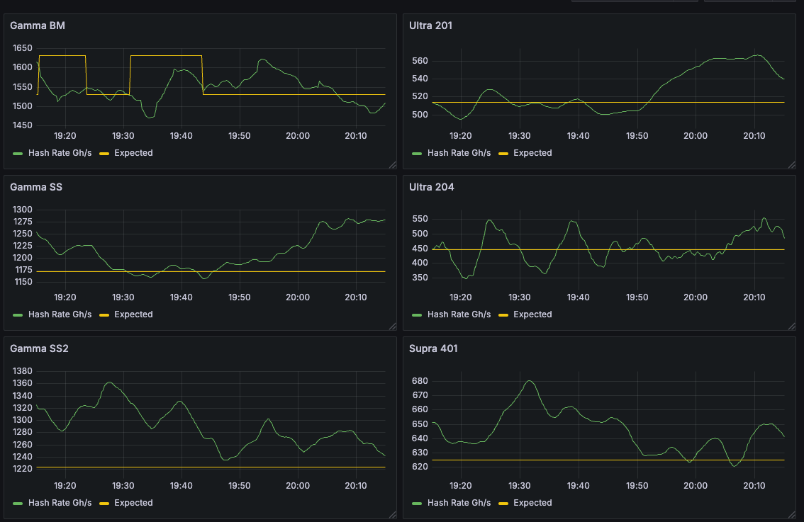

# Bitaxe Metrics

Scans the network for Bitaxe miners and exposes metrics in Prometheus format.  The default polling interval is 10 seconds.  The metrics are currently

- ASIC Frequency (setting)
- Hash rate
- Expected Hash Rate
- Efficiency
- Expected Efficiency
- ASCI Temperature
- Voltage Regulator Temperature
- Core Voltage (setting)
- Power
- Shares Accepted
- Shares Rejected

# Running

[Docker](https://www.docker.com/) and [Go](https://go.dev/) are required to run the program.

Modify the prometheus.yml to point to the IP where the Go program will be run, set to `host.docker.internal` by default. Then `docker compose up` to start Prometheus and Grafana. Prometheus will be on port 9090 http://localhost:9090/ and Grafana will be on port 3000 http://localhost:3000/

```
docker compose up
```

Run the Go program to scan the network and start collecting metrics. The metrics are exposed on port 8077, http://localhost:8077/metrics where Prometheus will pick them up.  

```
go run main.go
```

# Grafana Graphs

The default login for Grafana is admin/admin at http://localhost:3000.  There are 2 dashboards created by default with some example graphs.



# Score And Averages

A score is calculated for (T)emperature, (H)ash rate, and (E)fficiency.  The score is just an indicator if the measured value is better (> 1) or worse (< 1) when compared to the expected value.  This score, the current measured values, and the average values are displayed in the console output for each Bitaxe.

```
gamma_bm_led3: 750MHz 1150
Score: T: 1.063395 H: 1.139098 E: 1.139098
Value: T: 61.125000 H: 1742.820635 E: 14.566595
Avg: T: 61.032895 H: 1577.383287 E: 16.154163 S: 1.034373
```

The averages are not persistent, they are reset if the Go program restarts.